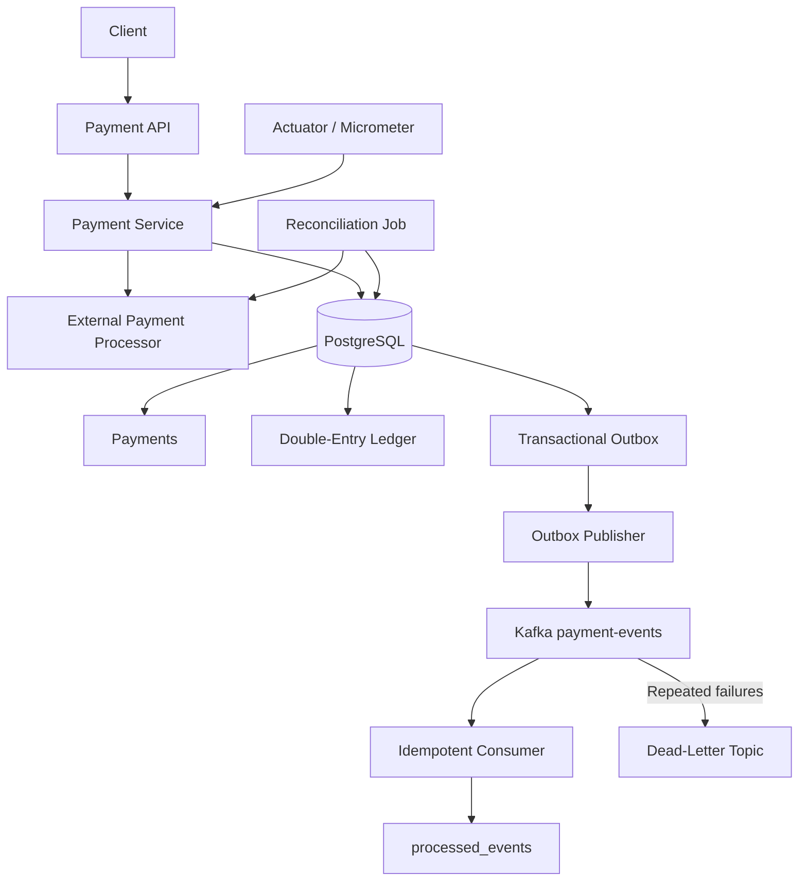

// GENERATED BY AI 

# Fault-Tolerant Payment Infrastructure

A payment-processing backend built with Java and Spring Boot that explores the reliability problems behind real payment systems: idempotency, distributed failures, double-entry accounting, event delivery, reconciliation, and failure recovery.

The project intentionally simulates external processor failures and ambiguous network timeouts to demonstrate how payment state can remain correct even when distributed systems disagree.

## Highlights

- Concurrency-safe payment creation using idempotency keys
- Explicit payment state machine
- Simulated external payment processor
- Ambiguous timeout handling with an `UNKNOWN` state
- Automatic payment reconciliation
- Double-entry ledger for captures and refunds
- Transactional outbox pattern
- Kafka-based event publishing
- Idempotent Kafka consumers
- Retry and dead-letter handling
- Flyway database migrations
- PostgreSQL-backed integration tests with Testcontainers
- Spring Boot Actuator and Micrometer metrics
- k6 load and resilience testing
- Development-only failure simulation through Spring profiles

---

## Architecture



### Payment lifecycle

```text
CREATED
   |
   v
AUTHORIZED
   |
   v
CAPTURED
   |
   v
REFUNDED
```

Failures can transition a payment to:

```text
FAILED
```

An ambiguous processor timeout transitions the payment to:

```text
UNKNOWN
```

The reconciliation process later asks the processor for the true transaction status and repairs the local state.

---

## Why `UNKNOWN` Exists

A timeout does not prove that a remote operation failed.

For example:

```text
Payment service
    |
    | authorize $100
    v
Processor
    |
    | authorization succeeds
    |
    X response lost
```

The processor may have successfully authorized the transaction even though the payment service never received the response.

Marking the payment as `FAILED` would therefore be incorrect.

Instead:

```text
timeout
   |
   v
UNKNOWN
   |
   v
reconciliation
   |
   +---- processor says AUTHORIZED ---> AUTHORIZED
   |
   +---- processor says FAILED -------> FAILED
```

The processor transaction ID is retained so the original transaction can be queried rather than blindly retrying the authorization.

---

## Idempotency

Payment creation requires an:

```text
Idempotency-Key
```

The database enforces uniqueness on this value.

If the same request is submitted multiple times:

```text
same key
same amount
same currency
```

the original payment is returned.

If the same key is reused with a different request:

```text
same key
different amount/currency
```

the API returns a conflict.

Concurrent requests are protected with PostgreSQL:

```sql
INSERT ... ON CONFLICT DO NOTHING
```

This prevents multiple application threads from creating duplicate logical payments.

---

## Double-Entry Ledger

Capturing a payment creates a balanced ledger transaction.

Example for a `$100` capture:

```text
DEBIT   PROCESSOR_CLEARING   $100
CREDIT  MERCHANT_PAYABLE    $100
```

A full refund reverses the entries:

```text
DEBIT   MERCHANT_PAYABLE     $100
CREDIT  PROCESSOR_CLEARING   $100
```

Every ledger transaction enforces the invariant:

```text
total debits = total credits
```

Payment-state updates and ledger writes occur in the same PostgreSQL transaction.

---

## Transactional Outbox

Publishing directly to Kafka after committing a database transaction creates a dual-write problem:

```text
Database commit succeeds
        |
        X
Kafka publish fails
```

The payment would be stored but the event would disappear.

Instead, the application writes an outbox event in the same database transaction as the payment update:

```text
Payment transaction
   |
   +-- payment update
   +-- ledger entries
   +-- outbox event: PENDING
   |
COMMIT
```

A background publisher later sends pending events to Kafka and marks them as `PUBLISHED`.

This provides durable event delivery without requiring a distributed transaction between PostgreSQL and Kafka.

---

## Kafka Delivery

Payment events are published to:

```text
payment-events
```

The payment ID is used as the Kafka key so events belonging to the same payment can remain associated with the same partition.

The delivery model is intentionally at-least-once.

This means duplicate delivery is possible.

Consumers therefore store processed event IDs in:

```text
processed_events
```

If the same event arrives again:

```text
event already processed
        |
        v
ignore duplicate
```

---

## Retry and Dead-Letter Handling

Consumer failures are retried.

```text
Kafka event
   |
   v
consumer
   |
   X failure
   |
retry
   |
   X failure
   |
retry
   |
   X
payment-events.DLT
```

Events that repeatedly fail processing are moved to:

```text
payment-events.DLT
```

so they do not permanently block normal event consumption.

---

## Automatic Reconciliation

A scheduled job periodically searches for:

```text
status = UNKNOWN
```

For each payment it queries the external processor using the stored processor transaction ID.

```text
UNKNOWN payment
      |
      v
processor.getStatus(...)
      |
      +---- AUTHORIZED ---> reconcile to AUTHORIZED
      |
      +---- FAILED -------> reconcile to FAILED
```

The resulting state update also generates an outbox event and therefore flows through Kafka.

---

## Database Migrations

Database schema ownership is handled by Flyway.

Migrations live under:

```text
src/main/resources/db/migration
```

The initial migration is:

```text
V1__initial_schema.sql
```

Hibernate is configured with:

```properties
spring.jpa.hibernate.ddl-auto=validate
```

so Hibernate validates entity/schema compatibility without modifying the database.

---

## Observability

Spring Boot Actuator and Micrometer expose application and infrastructure metrics.

Examples include:

```text
http.server.requests
jvm.memory.used
process.cpu.usage

hikaricp.connections.active
hikaricp.connections.pending
```

Custom payment metrics include:

```text
payments.created
payments.authorized
payments.captured
payments.refunded
payments.unknown

reconciliation.attempts
reconciliation.successes
reconciliation.failures
```

Health:

```text
GET /actuator/health
```

Metrics:

```text
GET /actuator/metrics
```

Specific metric:

```text
GET /actuator/metrics/payments.created
```

---

## Integration Testing

Integration tests use Testcontainers to start a temporary PostgreSQL instance.

The test suite verifies core invariants including:

- repeated idempotent requests return the same payment
- concurrent requests cannot create duplicate logical payments
- successful capture creates balanced ledger entries
- refunds generate the correct reversal entries
- processor timeouts create `UNKNOWN` payments
- reconciliation repairs ambiguous payment state
- payment lifecycle changes generate transactional outbox events
- Flyway migrations work against a clean PostgreSQL database

Run:

```bash
mvn clean test
```

---

## Load Testing

Load tests are located under:

```text
load-tests/
```

and use k6.

The benchmarks are local development benchmarks and should not be interpreted as production capacity.

### Healthy-system capacity test

A mixed payment workflow includes:

```text
create
   |
authorize
   |
~30% capture
```

The application sustained:

```text
300 payment workflows / second
```

for a 2-minute local capacity test.

Results:

| Metric | Result |
|---|---:|
| Completed workflows | 36,001 |
| Workflow success | 100% |
| HTTP failure rate | 0% |
| Dropped iterations | 0 |
| HTTP p95 latency | 21.51 ms |
| HTTP p99 latency | 38.09 ms |
| HTTP requests | 82,676 |
| Average HTTP throughput | ~687 requests/sec |

Load started degrading between approximately `300–350 workflows/sec` in the tested local environment.

At 350 workflows/sec, latency increased sharply and k6 began dropping scheduled iterations, indicating the beginning of the local saturation region.

### Reconciliation recovery test

The resilience benchmark intentionally configured the fake processor to authorize transactions and then simulate network timeouts.

Each payment therefore entered:

```text
UNKNOWN
```

before being automatically reconciled.

Results across 600 simulated ambiguous transactions:

| Metric | Result |
|---|---:|
| UNKNOWN payments | 600 |
| Reconciliation success | 100% |
| Average recovery time | 5.82 s |
| Median recovery time | 5.56 s |
| p95 recovery time | 10.6 s |
| Maximum recovery time | 12.13 s |
| HTTP failure rate | 0% |
| Dropped iterations | 0 |

These results align with the reconciliation worker's approximately 10-second scheduling interval.

---

## Technology Stack

### Backend

- Java 21
- Spring Boot
- Spring Data JPA
- Hibernate
- Maven

### Data

- PostgreSQL
- Flyway
- HikariCP

### Messaging

- Apache Kafka
- Spring Kafka

### Reliability / Testing

- Testcontainers
- JUnit
- k6

### Observability

- Spring Boot Actuator
- Micrometer

### Infrastructure

- Docker
- Docker Compose

---

## Running Locally

### Prerequisites

Install:

```text
Java 21
Maven
Docker
```

k6 is optional and only required for load testing.

### Start infrastructure

```bash
docker compose up -d
```

This starts PostgreSQL and Kafka.

### Run the application

```bash
mvn spring-boot:run
```

The API runs by default on:

```text
http://localhost:8081
```

### Run tests

```bash
mvn clean test
```

---

## Configuration

Configuration can be overridden using environment variables.

Available settings include:

```text
SERVER_PORT
DB_URL
DB_USERNAME
DB_PASSWORD
KAFKA_BOOTSTRAP_SERVERS
KAFKA_CONSUMER_GROUP
SHOW_SQL
```

Example values are provided in:

```text
.env.example
```

---

## Development Profile

Failure-simulation endpoints are intentionally excluded from the default application profile.

Enable them with:

```bash
SPRING_PROFILES_ACTIVE=dev
```

On PowerShell:

```powershell
$env:SPRING_PROFILES_ACTIVE="dev"
mvn spring-boot:run
```

The development profile enables utilities for:

```text
processor success/failure/timeout simulation
Kafka event replay
Kafka consumer failure simulation
```

These endpoints are not registered during a normal application startup.

---

## Example API Flow

Create a payment:

```http
POST /payments
Idempotency-Key: example-001
Content-Type: application/json

{
  "amount": 100.00,
  "currency": "CAD"
}
```

Authorize:

```http
POST /payments/{paymentId}/authorize
```

Capture:

```http
POST /payments/{paymentId}/capture
```

Refund:

```http
POST /payments/{paymentId}/refund
```

Retrieve:

```http
GET /payments/{paymentId}
```

---

## Reliability Invariants

The project is designed around several explicit invariants:

1. One idempotency key represents at most one logical payment.
2. Reusing an idempotency key with different request data is rejected.
3. Invalid payment-state transitions are rejected.
4. A network timeout is not treated as proof of processor failure.
5. Every ledger transaction must balance debits and credits.
6. Payment, ledger, and outbox writes belonging to one local operation commit atomically.
7. Outbox events remain durable until successfully published.
8. Kafka consumers tolerate duplicate event delivery.
9. Repeatedly failing events are isolated using a dead-letter topic.
10. Ambiguous payments are automatically reconciled against the processor source of truth.

---

## What This Project Explores

This project is less about building a checkout UI and more about the engineering problems underneath payment infrastructure:

```text
What happens if a client retries?

What happens if two identical requests arrive simultaneously?

What happens if the processor succeeds but the network times out?

How do accounting records stay balanced?

How do database writes and Kafka publishing remain reliable?

What happens when Kafka delivers an event twice?

What happens when a consumer repeatedly fails?

How can uncertain transactions repair themselves automatically?
```

Those failure modes drive the architecture of the system.